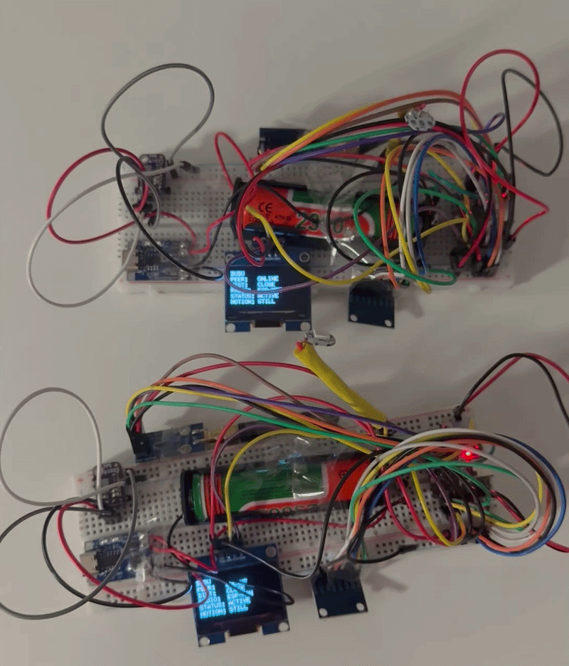
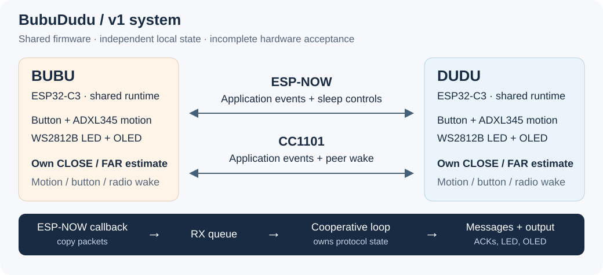
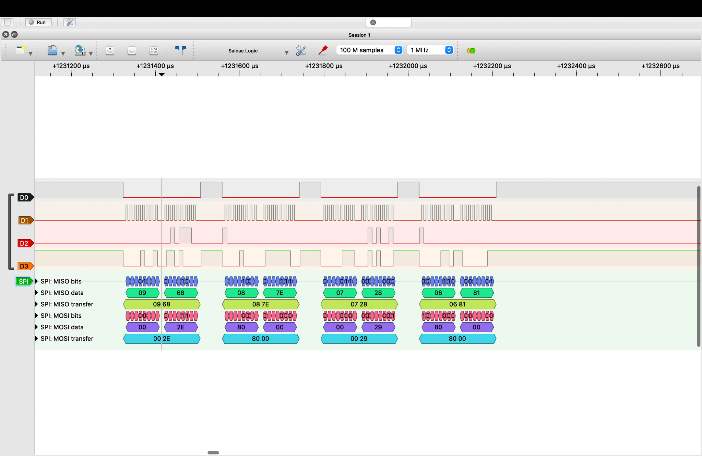

# BubuDudu

| ▶ [Nearby wake](https://github.com/1m2s/BubuDudu/releases/download/v1/ClosePeerWake.mov) | ▶ [Wake farther apart](https://github.com/1m2s/BubuDudu/releases/download/v1/FarPeerWake.mov) | ▶ [Motion and button demo](https://github.com/1m2s/BubuDudu/releases/download/v1/MovingBehavior.mov) |
| :---: | :---: | :---: |
| Wake one device and its nearby partner. | Peer wake with the devices farther apart. | Movement, status changes and button interaction. |

**Open a video above to watch or download the original MOV.**
[All videos and file details](docs/videos/README.md).

## The idea

BubuDudu is a pair of symmetric wireless embedded devices built to explore reliable communication, low-power operation and multi-radio system design.

Both devices run the same firmware on an ESP32-C3 and can communicate bidirectionally using two wireless technologies: **ESP-NOW as the primary low-latency link** and a **CC1101 433 MHz radio as a secondary communication and wake-up path**.

The devices can detect motion, enter low-power sleep states, wake when moved, and wake their sleeping peer over radio. An OLED provides live diagnostic information such as connection state, radio status, proximity, message activity and power state.

User interactions are built on top of this system. For example, pressing a button on one device sends an event to its peer, which responds with a heartbeat animation on its WS2812B LED.

The project is therefore not just about remotely triggering an LED—it is about building and testing a small distributed embedded system with **bidirectional communication, dual-radio operation, peer wake-up, motion-based power management, diagnostics and reliable event delivery**.

**v1 prototype · development paused · 4 October 2026.** LED output, motion,
sleep and peer wake worked in my demos. The main problem is unreliable proximity
and radio switching: after one device moves away and returns, the stationary
one can stay stuck on FAR / CC1101 until it is moved. Full two-device testing
is incomplete. See [results and known problems](FINAL_FIRMWARE_TEST.md).

## What it does

- Provides **bidirectional wireless communication** between two identical ESP32-C3 devices.
- Uses **ESP-NOW as the primary radio** and a **CC1101 433 MHz link as a secondary communication and wake-up path**.
- Adds an application-level reliability layer with **message IDs, acknowledgements, timeouts, limited retries and duplicate detection**.
- Measures ESP-NOW signal strength to classify the peer as **CLOSE or FAR** and uses that information as part of the radio-selection logic.
- Supports **automatic fallback between radios** when the preferred communication path is unavailable.
- Monitors movement using an **ADXL345 accelerometer** and uses motion information as part of the device's power-management system.
- Coordinates sleep between both devices through a **peer sleep handshake** instead of allowing either device to disappear unexpectedly.
- Supports waking from **local motion, button input and a wireless peer-wake request**.
- Displays live system information on an **OLED**, including connectivity, proximity, active radio, message activity and power state.
- Drives **non-blocking WS2812B animations**, allowing visual feedback to run without stopping communication, sensing or system-state handling.
- Includes button-triggered heartbeat events as one example application running on top of the communication system.

[How the code works](ARCHITECTURE.md) · [Hardware and upload](INTERFACES.md) ·
[Button behavior](BUTTON_HEARTBEAT.md) · [Features](REQUIREMENTS.md) ·
[Builds and tests](tests/host/README.md)

## What I learned

I study Electrical Engineering & IT at RWU Ravensburg-Weingarten and am entering
semester 4. This project builds on an embedded-systems course I completed from
the University of Colorado Boulder, plus RWU's **Computer Technology** and
**Digital Electronics** lectures and labs, and my university **Circuit Design** class.

I applied binary data, registers, bit masks, interrupts, logic, state machines
and timing to a working device. The Digital Electronics lab's LED patterns and
PWM exercises also connect to the heartbeat idea. [My reflection](docs/V1_REFLECTION.md#what-my-rwu-subjects-contributed)
shows the links to the coursework and what I would improve.

Development was AI-assisted. I am still improving my ability to explain and
change the C++ code myself. Work ran from September to October 2026.

Unavailable 18650 batteries and a 5 V boost module delayed realistic distance,
return and radio-fallback tests. That taught me to plan the power hardware needed
for testing early. I have ideas for fixes, but am pausing to focus on the university
semester. There is no planned v2 date. [Testing constraints and lessons](docs/V1_REFLECTION.md#why-physical-validation-came-late).

## Debugging and electronics

| Radio debugging | Battery-indicator idea |
| --- | --- |
|  |  |
| SPI signals from early radio work. | Applying Circuit Design lessons in Falstad; simulation only, not built. |

The battery-indicator idea was my attempt to apply what I learned in university
Circuit Design: using resistors to scale a voltage, comparing it with reference
voltages, and showing the result with LEDs. [What I tried](docs/V1_REFLECTION.md#electronics-that-remain-unfinished).

[Image notes](docs/images/README.md) · [Simulation file](simulations/battery_indicator_v1.txt) ·
[Development log](DEVLOG.md)

## Which code was tested

I flashed both devices from [`ecd9d4f`](https://github.com/1m2s/BubuDudu/commit/ecd9d4fb9920d876e0acea3a3579429e222af718).
Its firmware files match PR #1's merge [`3f6ae82`](https://github.com/1m2s/BubuDudu/commit/3f6ae82)
and the [`v1` release](https://github.com/1m2s/BubuDudu/releases/tag/v1)
at [`d5acad1`](https://github.com/1m2s/BubuDudu/commit/d5acad1b4a348ce7434fcf82c9852260adb31117).
Later edits changed documentation and comments only. The v1 tag stays fixed.

[CI run 37152115281](https://github.com/1m2s/BubuDudu/actions/runs/37152115281)
passed the computer tests and both builds for `ecd9d4f`. I did not save upload
logs, and the devices cannot display their firmware version.
[Cleanup checklist](docs/V1_AUDIT_RESOLUTION.md).
