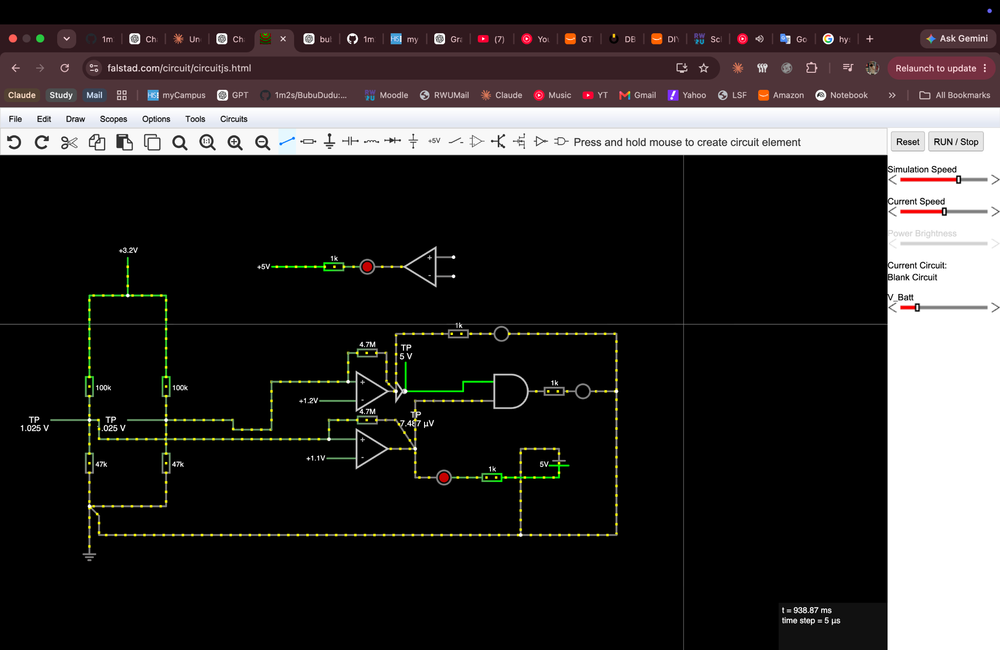

# v1 reflection and possible v2

**Closed development period: 4 October 2026 (Europe/Berlin).** v1 is a partially
working integrated prototype. Development is paused until free time is available,
possibly during a holiday; no v2 date is promised. The [final physical findings](../FINAL_FIRMWARE_TEST.md)
are the acceptance record. The evidence levels and remaining limitations are defined there.

## Learning context

I am an Electrical Engineering & IT student at RWU Ravensburg-Weingarten,
entering semester 4. I completed an embedded-systems course from the University
of Colorado Boulder and used this project to practise embedded design. My RWU
Computer Technology and Digital Electronics subjects and labs supplied further
foundations, described in the [coursework connections](#what-my-rwu-subjects-contributed) below.

Development was AI-assisted, including implementation and documentation. I want
to become better at explaining, tracing and modifying the implementation myself.
A useful next exercise is to follow one button request from input to queue, packet, ACK and
receiver animation, then explain each timeout and failure path without relying
on generated explanations.

The development records span 7 September–4 October 2026. This date range does
not estimate working days or hours.

## What my RWU subjects contributed

Alongside the University of Colorado Boulder course, I drew on **Computer
Technology (Rechnertechnologie)** and **Digital Electronics**, including their
labs at RWU. These subjects gave me foundations that I wanted to apply in a
complete embedded project.

| Subject | What I learned and practised | Connection to BubuDudu |
| --- | --- | --- |
| **Computer Technology — lecture** | Binary/hexadecimal representation, data sizes, registers and memory, byte ordering, and interrupts: hardware requests for the processor's attention. | These concepts help me reason about the fixed-width fields in the eight-byte [message](../include/Protocol.h) and the ADXL345 [interrupt path](../src/Motion.cpp), which records a notification before the loop reads the sensor's event register. |
| **Computer Technology — lab** | ARM assembly load/store operations (reading/writing memory), condition flags, bit masks (selecting individual bits), and Linux/Make build tools. | Bit operations connect directly to sensor register settings and the [GPIO wake masks](../src/CC1101WakeRecovery.cpp). Understanding compilation and linking helps me follow how PlatformIO turns the shared source into the two firmware builds. |
| **Digital Electronics — lecture** | Boolean logic and truth tables, logic levels, combinational/sequential circuits, and finite state machines: behavior described by states and transitions. | I applied this way of thinking to the conditions that permit sleep, active-HIGH/LOW inputs, the [power state machine](../src/PowerManager.cpp) and the [LED animation phases](../src/LED.cpp). |
| **Digital Electronics — lab** | VHDL hardware descriptions for an FPGA, logic from function tables, timed LED bit patterns including a heartbeat-style pattern, and pulse-width modulation (PWM), which varies a signal's on-time. | The LED exercises gave me useful practice thinking about output sequences, timing and brightness. BubuDudu's heartbeat uses a C++ state machine that sends colour values to a WS2812B through the NeoPixel library. |

The Computer Technology lab uses ARM assembly; BubuDudu runs C++ on the
ESP32-C3's RISC-V processor. The Digital Electronics lab uses FPGA/VHDL
hardware designs; BubuDudu implements its state machines in software. I am
applying the underlying ideas across those platforms. Lab preparation,
measurement and report writing also connect to the project's dated observations
and the separation between expected behavior and recorded results.

### Course material references

The topic mapping above uses the lecture/lab materials by **Prof. Dr.-Ing.
A. Siggelkow, Hochschule Ravensburg-Weingarten**. Dates identify the material
editions, not the dates I completed a subject.

- *Computer Technology*, 23 March 2026: sections 3.1–3.2 (data and addressing),
  4.6 (logical operations), 4.12 (compilation/linking) and 6.2.1 (interrupts).
- *Rechnertechnologie: Labor*, 14 February 2024: sections 2.3–2.6 (Linux and build
  tools), chapter 3 (load/store), chapter 4 (flags) and chapter 5 (bit masks).
- *Digital Electronics*, 30 September 2025: chapters 2–4 (numbers, Boolean and
  combinational logic), chapter 6 (sequential logic), chapter 7 (state machines)
  and chapter 8 (VHDL).
- *Digital Electronics: Lab Notes*, 22 October 2025: chapters 2–4 (VHDL and logic
  design), chapter 5 (LED bit patterns) and chapter 6 (PWM dimming).

## Concepts I tried to put into practice

| Concept | Concrete repository example and learning value |
| --- | --- |
| Shared firmware configuration | [PlatformIO identities](../platformio.ini) and [Config.h](../include/Config.h) build Bubu and Dudu from the same source. Identity differences need not become two diverging programs. |
| Hardware interfaces | [Interfaces](../INTERFACES.md) maps shared I²C, CC1101 SPI and GPIO wake inputs. Motion initializes I²C once before the OLED uses it. A bus ACK alone cannot establish correct application behavior. |
| Structured messages and reliability | [Protocol.h](../include/Protocol.h) defines an eight-byte message. [RadioRuntime](../src/app/RadioRuntime.cpp) matches ACKs, limits retries and keeps a retry's ID stable; duplicates can be acknowledged without replaying an action. Failure remains possible after the budget. |
| Callbacks and queues | The ESP-NOW receive callback logs metadata and copies packets into a bounded queue; the cooperative loop processes them and owns protocol state. This separates arrival from decisions about retries, peer state and output. |
| State machines and non-blocking output | [PowerManager](../src/PowerManager.cpp) separates sleep agreement from execution. [LED.cpp](../src/LED.cpp) advances animation with time so normal loop servicing can continue. The active application does not create FreeRTOS application tasks. |
| Sleep/wake and retained state | [SleepRuntime](../src/app/SleepRuntime.cpp), [RtcState](../include/RtcState.h) and CC1101 wake modules distinguish boot evidence, retained messages, semantic agreement and guarded physical entry. Waking the peer and delivering its user event require different acknowledgements. |
| Debugging, version control and testing | Serial output, bus captures, host fault injection, sanitizer checks, builds and dated Git checkpoints answer different questions. A screenshot or a passing suite is useful only within that evidence's limits. |

The [architecture](../ARCHITECTURE.md) describes the final runtime ownership;
the [host guide](../tests/host/README.md) maps tests to responsibilities.

## Practices worth keeping

The September 22 [DEVLOG entry](../DEVLOG.md#2026-09-22) records a return to
incremental work after integration became difficult to debug. Moving protocol
work out of callbacks is a concrete improvement: one execution context can
reason about the pending packet and its ACK. Bounded retries and sleep deadlines
also turn missing responses into explicit outcomes rather than endless waiting.
They constrain failure; they do not guarantee delivery or repair a stopped radio.

Preserving working versions made it possible to back away from regressions.
The [October 3 session record](../DEVLOG.md#2026-10-03) retains abandoned
experiments in stashes/backups and distinguishes them from the restored baseline.
Historical branches remain useful evidence of subsystem bring-up, even when
their procedures no longer match main. They should be inspected at their recorded
commit, not blindly reapplied over the integrated firmware.

The [final integration record](../DEVLOG.md#2026-10-03--final-integration-and-software-validation)
documents isolated host suites and a Linux sanitizer failure in the simulated
reboot harness that local macOS checks had not reported. Fixing the harness's
queue lifetime while keeping sanitizers enabled is more informative than hiding
the failing check. Recording physical observations separately is equally useful:
the later transition failures remain failures despite successful CI.

## What I would approach differently

The scope was ambitious for the available time: two radios, local and peer state,
motion, proximity, user output and coordinated sleep all interact. This is
supported by the [September 20–21 integration record](../DEVLOG.md#2026-09-20-to-2026-09-21),
which describes combining too many subsystems before responsibilities were clear,
and the October 3 record of software-passing experiments with physical regressions.
Those examples suggest smaller integration steps and fewer simultaneous changes.

Transition testing and calibration were insufficient to establish reliable
integrated behavior. The final separation-and-return observation exposes an
especially important scenario: only one device moves, but both devices need
useful current state. Proximity is locally owned, refresh is event-triggered,
and timed-out checks retain the old classification. That is consistent with stale
state, not a confirmed diagnosis of every failure. I need a clearer policy for
who owns each fact, how old it may become, what refreshes it, and how uncertainty
is shown. Motion thresholds and RSSI boundaries are still provisional.

Passing host tests show expected behavior for modeled scenarios; they do not
establish reliable RF, actual scheduling, sensor calibration or visible OLED
output. The gap between those tests and physical behavior is a central v1 lesson.
Adding more components or abstractions is not automatically better engineering.
An extra radio, sensor or module is worthwhile only if it solves a defined problem
with understandable interfaces and evidence that the resulting system improves.

## Electronics that remain unfinished

*Simulation evidence: dividers, comparator stages, ideal reference sources and
logic driving LED states. This is not an assembled, measured indicator.*

The [September 19 record](../DEVLOG.md#2026-09-19) and
[Falstad export](../simulations/battery_indicator_v1.txt) preserve the analog
experiment. The screenshot includes feedback experimentation; the log records
deferring final hysteresis. Neither establishes real comparator behavior or a
finished analog power subsystem. The physical comparator indicator, reference
generation and MOSFET power gating were not completed.

On October 3 I assembled the battery supply and operated both devices from it.
I measured about 3.9 V per cell and 4.99–5.02 V at the booster output. I did not
measure current consumption, runtime or charging under load.

## Aspirations for a possible v2

| Direction | Purpose and evidence needed when work resumes |
| --- | --- |
| Evaluate ultra-wideband (UWB) ranging | Hopefully purchase suitable hardware and evaluate it for more precise distance measurement. No hardware choice, purchase or accuracy is claimed. A new sensor alone would not fix state ownership or refresh logic. |
| Strengthen programming understanding and state design | Trace the C++ paths, define state ownership and freshness, improve recovery behavior, and add integration scenarios for stationary-peer return and asymmetric state. |
| Purposeful MOSFET switching or subsystem power gating | Identify a useful load to control and account for wake availability and electrical behavior before selecting an implementation. More switching circuitry is not a goal by itself. |
| Build a simple comparator battery indicator | Start from the Falstad idea, then select real components and examine reference generation, input/output limits, tolerances, hysteresis and LED loading in an assembled, measured circuit. |
| Measure power and runtime | Record current in defined active/sleep/radio states and measure battery runtime under a stated workload. Characterize charging under load separately. |
| Reconsider optional features | Gestures, battery telemetry and interface changes remain ideas; implement them only when they serve a clear purpose. |

None of these items is already implemented or purchased as part of this closure.

## Saved restart point

1. Read [final findings](../FINAL_FIRMWARE_TEST.md) and the
   [v1 closure record](../DEVLOG.md#2026-10-04--v1-prototype-closure-and-development-pause).
   Use the [README version map](../README.md#which-code-was-tested) to distinguish
   the frozen `v1` tag from later documentation/comment cleanup on `main`.
   Review the [audit disposition](V1_AUDIT_RESOLUTION.md) before any code changes.
2. Inspect the then-current Git status and remote history before doing new work.
   Preserve the unrelated editor setting, historical branches, stashes, backups,
   original images and simulation. Do not restore an abandoned patch merely
   because it is available. Create an isolated v2 branch when development resumes.
3. Choose one question first: why does the stationary partner fail to refresh
   after separation and return? Record the actual matching firmware on both
   devices and, when testing resumes, pair serial traces with screen/LED
   observations and stated conditions. Compare local check triggers, accepted
   samples, timeout/cancellation and selected transport before choosing a fix.
4. Re-establish the existing host/build baseline from the [testing guide](../tests/host/README.md).
   Define one transition/recovery change with a focused integration case, then
   compare software results with repeated physical observations. Keep calibration,
   state refresh and radio recovery as distinct questions.

This is a future restart plan. v1 firmware development and physical testing are
complete for this development period, with the limitations recorded above.
