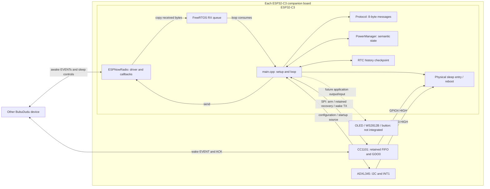

# Current architecture

Scope: verified firmware [`1b10419`](https://github.com/1m2s/BubuDudu/commit/1b1041976b4200668c3090d27c8138dc80aa53f2). File presence does not mean a module participates in the running application. The root [requirements](../REQUIREMENTS.md) describe the larger product; the table below describes what executes now.

## System boundary

Bubu and Dudu share firmware, with compile-time identities and opposite ESP-NOW peer MACs. Either can initiate events, sleep negotiation or a wake transmission. There is no permanent controller device.

The dotted UI connection is product intent. Current received EVENT execution is a Serial report and application-activity notification, not a heartbeat LED call. Motion is initialized and prepared for sleep; the loop does not consume `Motion::getEvent()` for awake behavior.

## Execution and ownership

| Context/module | Owns | Boundary |
| --- | --- | --- |
| Arduino `setup()` | Wake capture, fresh FSM, RTC restore, retained radio recovery, Motion/ESP-NOW startup | Deep wake never calls normal CC1101 cold reset before FIFO inspection |
| Arduino `loop()` in [main.cpp](../src/main.cpp) | Message allocator, pending packet/retries, EVENT history, control outbox, RX dispatch, bench commands | Single application owner; no protocol-state mutation by Wi-Fi callbacks |
| [ESPNowRadio](../src/ESPNowRadio.cpp) / Wi-Fi callbacks | Driver setup, raw send/receive, atomic TX-in-flight and active-RX counts | Callback logs and copies data through the registered queue handler; does not advance the FSM |
| [PowerManager](../include/PowerManager.h) | Local/peer semantic states, transaction deadlines, freshness, one-shot sleep decision | No hardware sleep, I2C, SPI or ESP-IDF dependency |
| CC1101 sleep/wake helpers | Readiness, retained packet access, bounded wake EVENT/ACK operations | Used by setup/loop; no general radio-selection layer or active RadioTask |
| [RtcState](../src/RtcState.cpp) | Validated 16-byte retained history | No pending queues, retry timers, sleep phases or runtime state restored |
| [Motion](../src/Motion.cpp) / GPIO ISR | ADXL configuration, startup event, ISR flag, sleep preparation | No power policy, peer wake decision or UI ownership |

FreeRTOS is used by Arduino/Wi-Fi and the eight-entry receive queue. This application does not create a dedicated user `RadioTask`. The queue drops on overflow without blocking the Wi-Fi task; missing application receipts let the sender's existing bounded retry policy act. Callback tracking closes the gap between an empty application outbox and a driver transmission that has not finished.

The loop services serial/deadlines, consumes at most eight queued packets, retires obsolete controls, handles retries and queued controls, services awake CC1101 duplicate ACK work, checks sleep execution, and finally schedules ordinary heartbeats. The loop ends with its existing 10 ms delay. The manual/boot CC1101 sender is synchronous and bounded; this is not a claim that every operation is non-blocking.

## Startup is part of the protocol

Deep sleep restarts the ESP32 but leaves the external CC1101 and ADXL345 powered. The wake packet and sensor interrupt are evidence held outside ordinary MCU RAM. RTC history is restored before deduplicating a retained EVENT. The CC1101 receipt is sent before Motion/I2C work and ESP-NOW startup.

At the end of successful startup, pure GPIO3 motion wake reuses the manual `w` helper once. GPIO4 participation suppresses the automatic return wake. If receive-queue or ESP-NOW startup fails, the automatic request is not attempted. A guard refusal is not retried from the loop; Motion initialization failure itself is logged and startup continues.

[Deep-sleep flow and radio recovery](deep-sleep-wake.md) describes the exact sequence. [Power management](power-management.md) separates semantic agreement from the physical execution gate.

## Scope and tradeoffs

- ESP-NOW is the awake application path; CC1101 is the narrow wake/retained-receipt path.
- Current application activity comes from explicit serial input and new peer EVENTs. Automatic inactivity sleep is not wired to Motion.
- No general radio fallback, sensitive awake-motion policy, integrated OLED/LED presentation, proximity consensus or battery policy is present.
- Retained state is a reboot-history checkpoint, not a power-loss journal or restored running task.
- A successful packet send/callback is not evidence of application processing. Receipt ACK, semantic sleep agreement and RX readiness are separate observations.

See the [module audit](repository-audit.md) for dormant prototypes and stale comments deliberately kept out of this behavior-preserving polish pass.
