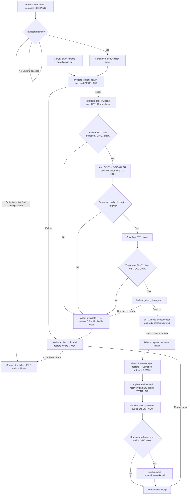
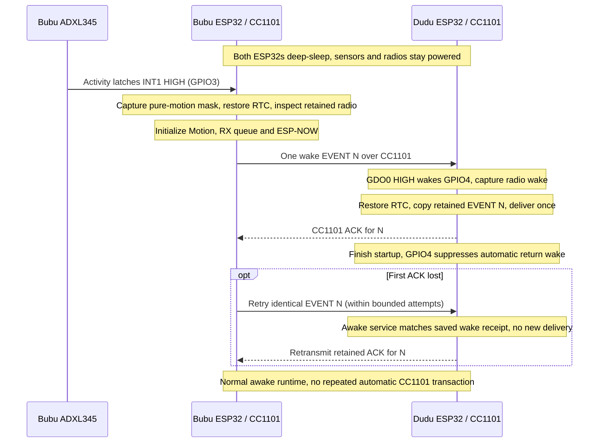

# Deep sleep, motion and peer wake

This is the current integrated path at `1b10419`: coordinated ESP-NOW sleep negotiation hands a one-time execution decision to `main.cpp`; the ESP32 enters real deep sleep with the ADXL345 and CC1101 still powered; retained radio data is inspected before normal startup. A pure local motion wake then requests one bounded CC1101 wake of the peer.

The implementation lives in [`main.cpp`](../src/main.cpp), [`Motion.cpp`](../src/Motion.cpp), [`CC1101SleepArm.cpp`](../src/CC1101SleepArm.cpp), [`CC1101WakeRecovery.cpp`](../src/CC1101WakeRecovery.cpp), [`CC1101WakeTx.cpp`](../src/CC1101WakeTx.cpp), and [`RtcState.cpp`](../src/RtcState.cpp). See [hardware](hardware.md) for wiring and radio settings, and the [current bench procedure](testing.md) for commands and checks.

## Runtime boundary

[`PowerManager`](../src/PowerManager.cpp) owns semantic sleep agreement; it does not call ESP32 sleep, SPI or I²C APIs. `main.cpp` owns transport state, drains pending work, consumes the sleep decision once, prepares Motion and invokes physical sleep. ESP-NOW remains the normal awake transport. The CC1101 path is deliberately limited to wake transmission, retained-packet recovery and re-ACKing the accepted wake packet while awake.

The current loop does **not** call `Motion::getEvent()` or connect sensor inactivity to automatic sleep. The driver configures awake activity/inactivity sensing, but that is not yet a more sensitive awake-motion application. Serial `i` and `s` exercise idle/negotiation; `a` injects application activity/cancellation. Manual `x` uses the same physical entry path without negotiating with the peer. Some historical source comments and startup text still say the handshake only stays awake or RTC saves are manual-only; executable code now performs real coordinated sleep.

## Startup order

The order in `setup()` protects the packet still held by the external radio:

1. `captureBoot()` runs **before Serial or SPI**. It records whether reset was from deep sleep, the wake cause, the actual GPIO mask, and early GPIO4/GPIO3 levels on deep wake.
2. Start Serial at 115200 and initialize fresh PowerManager state.
3. Choose the boot path:
   - **Deep wake:** restore valid RTC history, invalidate an unusable checkpoint, release retained CS hold with its output latch HIGH, attach MCU SPI/pins without a radio reset, inspect retained CC1101 state, copy/deliver a valid packet and send its CC1101 ACK, then attempt bounded RX restoration. Print the wake report.
   - **Cold boot:** invalidate RTC history, wait 1500 ms for startup diagnostics, then reset/configure the CC1101 once and enter RX through `CC1101SleepArm::begin()`.
4. Call `Motion::begin(0, 1, 3)`. It checks the ADXL345 identity and reads/clears the startup interrupt source **before** reconfiguring the sensor. Log initialization, INT1 level and the startup event. A failed identity check is logged while startup continues.
5. Create the eight-message ESP-NOW receive queue and initialize ESP-NOW. Queue or transport startup failure returns before `protocolReady` is set.
6. Schedule the initial normal heartbeat, set `protocolReady`, and evaluate the one-shot motion peer-wake rule once. This happens after retained radio recovery, Motion initialization and successful ESP-NOW runtime setup.

Deep wake skips the cold boot delay and `CC1101SleepArm::begin()`. Motion I²C work must remain after retained-packet recovery and ACK. The captured GPIO mask identifies the wake source; it does not decide whether retained FIFO data exists.

## Physical entry order

A completed handshake may still have an outstanding receipt ACK or Wi-Fi callback. `serviceSleepExecution()` waits up to **3000 ms** for the transport to drain before consuming `SleepDecision`. The gate requires runtime ready, no awake CC1101 re-ACK TX, no pending reliable packet, no queued control, no active sleep transaction, zero ESP-NOW TX callbacks in flight, no active RX callback, and an existing empty receive queue.

The participant can reach semantic `SLEEPING` after submitting `SLEEP_ACK`, before receiving that packet's ordinary receipt ACK. Exhausted final-receipt retries, a rejected receipt send after completion, or drain timeout prevent physical sleep. Callback completion establishes completion of the callback, not application-level delivery.

After drain succeeds, both coordinated entry and accepted manual `x` follow this sequence:

1. **Prepare Motion.** Pause the awake ISR and configure activity-only sleep sensing with checked I²C operations and LOW GPIO3. Failure invalidates RTC history and goes directly to Motion restoration.
2. **Invalidate any old RTC checkpoint.** Perform the bounded, read-only CC1101 arm inspection. It must report `READY`: valid identity/profile, RX state, empty FIFO without overflow, and LOW GDO0. Preparation never resets the radio, flushes FIFO, reads packet data or restarts RX.
3. **Recheck transport and GPIO3.** A new interrupt or new transport work refuses entry.
4. **Configure wake and hold.** Disable prior wake sources. Enable HIGH-level wake for GPIO4 and GPIO3 together (`mask = 0x18`) and a **30-second integration safety timer**. Drive CS HIGH, enable its GPIO hold, then enable deep-sleep hold.
5. **Log and flush Serial, then recheck transport/GPIO3.** Diagnostics themselves take time during which work can arrive.
6. **Save RTC history at the final boundary.** No later send is intentionally issued. Recheck transport/GPIO3 once more to catch work arriving during the save.
7. **Check GDO0 LOW immediately before `esp_deep_sleep_start()`.** Successful entry never returns; a wake reboots the ESP32.

Any return from physical entry is an abort. Cleanup invalidates the checkpoint, releases CS hold, disables wake sources and logs the reason. `enterPhysicalSleep()` attempts to restore awake Motion configuration on every return, even if initial Motion preparation failed. Coordinated failure then calls `notifySleepExecutionFailed()`: local state becomes `IDLE` with a three-second cooldown, transaction/execution authority is discarded, and peer state is retained because the peer may already be sleeping. This does not start an automatic sleep retry.

The timer is a bench recovery aid, not the final battery or production wake policy. Native USB may disappear during deep sleep; serial `p` reprints the captured deep-wake report after reconnection.

## Motion configuration and abort restoration

The sensor is an ADXL345 at `0x53`, with active-HIGH INT1 on GPIO3. The awake ISR only sets a software flag; reading `INT_SOURCE` clears the latched hardware event. Startup captures that event for diagnostics. `decodeEvent()` gives activity precedence if both activity and inactivity bits are present.

| Register | Normal awake setup | Sleep preparation |
| --- | --- | --- |
| `DATA_FORMAT` (`0x31`) | `0x09`: full resolution, ±4 g, active-HIGH interrupt | Unchanged; read back as `0x09` |
| `THRESH_ACT` (`0x24`) | `48`, approximately 3.0 g | Unchanged |
| `THRESH_INACT` (`0x25`) | `4`, approximately 0.25 g | Unchanged; inactivity interrupt disabled |
| `TIME_INACT` (`0x26`) | `3` seconds | Unchanged |
| `ACT_INACT_CTL` (`0x27`) | `0xFF`: AC-coupled activity/inactivity on X/Y/Z | Unchanged |
| `INT_MAP` (`0x2F`) | `0x00`: activity/inactivity routed to INT1 | `0x00`, read back |
| `POWER_CTL` (`0x2D`) | `0x28`: LINK + MEASURE | `0x08`: independent MEASURE, read back |
| `INT_ENABLE` (`0x2E`) | `0x18`: activity + inactivity | `0x10`: activity only, read back |

`prepareForSleep()` detaches the ISR, writes `INT_ENABLE = 0`, enters standby with `POWER_CTL = 0`, sets `INT_MAP = 0`, reads/clears `INT_SOURCE`, writes `POWER_CTL = 0x08`, and enables `INT_ENABLE = 0x10`. It checks the enable, map, power and format registers and finally requires GPIO3 LOW. Moving through standby when clearing LINK and disabling inactivity avoids depending on alternating activity/inactivity servicing while the CPU sleeps.

An I²C write/read failure, readback mismatch or asserted GPIO3 refuses entry. GPIO3 is checked again at the physical entry boundaries, including after the RTC save. A new or stuck-HIGH interrupt must not be cleared indiscriminately just to force sleep.

`cancelSleepPreparation()` disables interrupts, enters standby, restores `INT_MAP = 0x00`, `POWER_CTL = 0x28` and `INT_ENABLE = 0x18`, checks those values and resumes the ISR even if an I²C operation failed. There is no retry loop; `awake_restore=FAILED` remains visible in the log. Initial `Motion::begin()` primarily reports the identity check and does not have the same checked configuration/readback contract as sleep preparation.

The approximately 3 g threshold is the existing deliberate-motion setting in both awake and sleep configurations. It is a physically tested starting point, not a guarantee of desk-vibration rejection for every enclosure or mounting.

## RTC keeps history, not pending work

[`RtcState`](../include/RtcState.h) stores a validated 16-byte checkpoint:

| Retained history | Purpose |
| --- | --- |
| `nextMessageId` | Continue the existing allocator after deep wake |
| Last peer EVENT ID and validity flag | Avoid delivering the last accepted EVENT twice |
| Newest peer sleep REQUEST watermark and validity flag | Reject already handled peer requests after reboot |
| Magic, version, flags and checksum | Detect invalid or incompatible data |

Message IDs are `uint16_t`; zero and `0xFFFF` are valid, and validity flags indicate whether history exists. The checksum is FNV-1a over explicit serialized bytes. Saving invalidates first and publishes magic last. This is a single-owner RTC snapshot, not a power-loss journal or flash persistence.

The checkpoint does **not** contain active negotiation, role/phase, deadlines, cooldown, retries, pending messages, queues, `SleepDecision`, or prior local/peer power states. `PowerManager::begin()` creates fresh runtime state; restore applies history only before transport is enabled. Successful restore consumes the checkpoint by invalidating it, cold boot invalidates it, and any entry abort invalidates it.

## Retained CC1101 packet recovery

With `IOCFG0 = 0x07`, a CRC-valid packet latches GDO0 HIGH. The radio returns to IDLE with the complete packet in FIFO, and GPIO4 wakes the ESP32. CS remains HIGH through sleep so startup can attach to the retained radio without resetting it.

Recovery runs on **every deep wake**, including motion and timer wakes. Healthy RX with an empty FIFO is normal and is left alone: no application EVENT or ACK is invented. A coincident real packet is inspected even when the captured GPIO mask did not include GPIO4.

The recovery path verifies radio identity/profile and retained state before consuming data. Unknown configuration or unavailable radio is preserved; an incomplete packet outside IDLE is preserved. For a complete packet, it copies FIFO data before any restart/flush, checks one length byte plus the exact eight-byte payload, and validates protocol version, peer identity, `Event`, `Heartbeat` and `ackForMessageId = 0`.

A valid packet is delivered only if RTC history restored successfully. The existing EVENT handler uses that history to process a new EVENT once or recognize a duplicate; it does not send through ESP-NOW during this early callback. It allocates a CC1101 receipt ACK instead. If RTC is invalid, the packet is not delivered or acknowledged as an application success.

The receipt is retained in RAM before its first TX, so TX failure or ACK loss does not erase retry authority. The ACK is transmitted before one bounded RX restart. Packet recovery, application delivery, ACK transmission and final RX readiness are separate report fields; a failed final restart does not erase earlier delivery or ACK evidence. Recovery does not run an endless reset/retry episode.

Representative recorded radio-wake evidence is `mask=0x10`, `MARCSTATE=0x01`, `RXBYTES=0x09`, `IOCFG0=0x07`, RTC restore OK, one processed EVENT, a sent ACK and RX ready. The nine FIFO bytes are the length byte plus `Protocol::Message`, not an extra application payload.

## Lost wake ACK while the receiver is awake

If the first wake ACK is lost, the sender retries the same EVENT after the receiver has finished booting. `serviceAwake()` accepts only a valid retry matching the boot-accepted wake EVENT's ID and retransmits the retained ACK without calling the application handler again. That receipt remains usable even when ESP-NOW has advanced the ordinary last-EVENT history.

This service does not deliver new awake CC1101 EVENTs. Malformed or unrelated complete packets do not acquire application-delivery authority. While listening, LOW GDO0 avoids SPI work. During re-ACK transmission, completion is polled across loop iterations after a 1 ms settling interval, with a 200 ms TX limit. Failed RX restart or unknown radio state stops the service rather than repeatedly attempting recovery. Sleep and another wake transmission are blocked while re-ACK TX is in progress.

The [September 25 log](../DEVLOG.md#lost-cc1101-wake-ack-and-awake-retry-handling) records physical tests in both directions using temporary first-ACK suppression. The permanent source no longer contains that CC1101 suppression flag. The receiver re-ACKed the same wake ID and the sender succeeded without a second application execution.

## One-shot motion wake of the peer

Both automatic motion wake and serial `w` call `requestPeerWake()`. It requires runtime ready, no re-ACK TX, no pending reliable message or queued controls/RX data, no active sleep transaction, and an ACTIVE/IDLE state where automatic heartbeat is allowed. It then allocates **one** heartbeat EVENT using the shared message-ID allocator and calls the existing bounded `CC1101WakeTx::send()`.

The radio helper checks readiness without destroying pre-existing FIFO data. Retries reuse the same ID and payload, with a 300 ms ACK wait and at most two retries: **three total attempts**, not three new events. TX completion is bounded to 200 ms, SPI readiness is bounded, and there is one RX-recovery budget for the whole call. ACK matching validates version, peer, ACK type, `event = None` and `ackForMessageId`. `ACKED` and final `RX_READY` are independent outcomes.

| Captured startup evidence | Automatic peer wake |
| --- | --- |
| GPIO3 present, GPIO4 absent | One call after successful runtime startup |
| GPIO4 only | None |
| GPIO3 and GPIO4 together | None |
| Timer, other wake, or cold boot | None |

The policy uses `BootInfo::wokeFromGpio()`, not the sensor's startup event or the current pin level. GPIO4 participation suppresses a return wake even when GPIO3 also fired. This avoids automatic ping-pong. Runtime startup failure sends nothing; a guard refusal or failed transaction does not create a deferred retry. The rule is evaluated once in `setup()`, never rearmed in `loop()`.

The reverse direction uses the same code. Local motion does not separately execute a local emotional heartbeat action. The peer's wake EVENT uses the established heartbeat EVENT meaning; today processing is represented by serial output, with LED/UI integration still pending.

If the peer is unavailable, the bounded call can exhaust its retries and return with the local runtime still usable. The CC1101 helper itself does not set peer state OFFLINE. Ordinary ESP-NOW heartbeat loss can subsequently do that. The bench `h` heartbeat-pause flag is RAM-only and resets on reboot, so normal ESP-NOW EVENT attempts after wake are not evidence of a repeated automatic CC1101 wake call.

## Physical evidence and host coverage

The [September 24](../DEVLOG.md#2026-09-24) bench results cover coordinated sleep in both initiation directions and simultaneous negotiation, timer recovery, and retained CC1101 wake/ACK in both directions. The [September 25](../DEVLOG.md#2026-09-25) results add lost-first-ACK recovery, local GPIO3 wake on both devices, preserved GPIO4 wake, motion-triggered peer wake in both directions, and an unavailable-peer test with retry exhaustion and responsive local runtime. CC1101-only and timer wakes did not start automatic peer wake in those tests.

Host tests separately cover combined GPIO3/GPIO4 classification, coincident-packet preservation, invalid RTC history, checked I²C failures, stuck-HIGH GPIO3, abort restoration, an interrupt arriving after RTC save, startup ordering/failures, same-ID retries, guard refusals and repeated loop execution without rearming. Relevant suites are [`motion_sleep_test.cpp`](../tests/host/motion_sleep_test.cpp), [`cc1101_sleep_arm_test.cpp`](../tests/host/cc1101_sleep_arm_test.cpp), [`cc1101_wake_test.cpp`](../tests/host/cc1101_wake_test.cpp), [`cc1101_wake_tx_test.cpp`](../tests/host/cc1101_wake_tx_test.cpp), [`rtc_state_test.cpp`](../tests/host/rtc_state_test.cpp), [`espnow_drain_test.cpp`](../tests/host/espnow_drain_test.cpp), and [`sleep_handshake_test.cpp`](../tests/host/sleep_handshake_test.cpp).

Combined-pin software coverage does not mean a simultaneous two-pin physical wake was reproduced. Bench success is evidence for the recorded scenarios, not every RF-loss pattern, final current consumption, battery life or production readiness.

## Future awake motion and UI behavior

The [recorded next requirement](../DEVLOG.md#future-awake-motion-and-emotional-ui) is to tune separate SLEEP and AWAKE sensitivity profiles. SLEEP should keep deliberate-motion wake; AWAKE should detect ordinary pickup/movement more sensitively, with its threshold established on physical hardware. This is not implemented in the current driver integration.

Keep the last confirmed proximity (`CLOSE` / `FAR`) separate from update status (`READY`, `MOVING`, `WAITING/CHECKING`). While moving, retain the confirmed proximity and continue its LED heartbeat. Once movement settles, check a fresh rough RSSI/proximity result and change CLOSE/FAR only when a result is confirmed. Movement alone must not blank LEDs, stop the heartbeat, erase or immediately change proximity, or create an emotional heartbeat EVENT.

Awake sensor tuning, proximity refresh and UI ownership remain separate future checkpoints. The current retained-packet startup order, activity-only sleep preparation and one-shot peer-wake behavior are the verified baseline to preserve.
