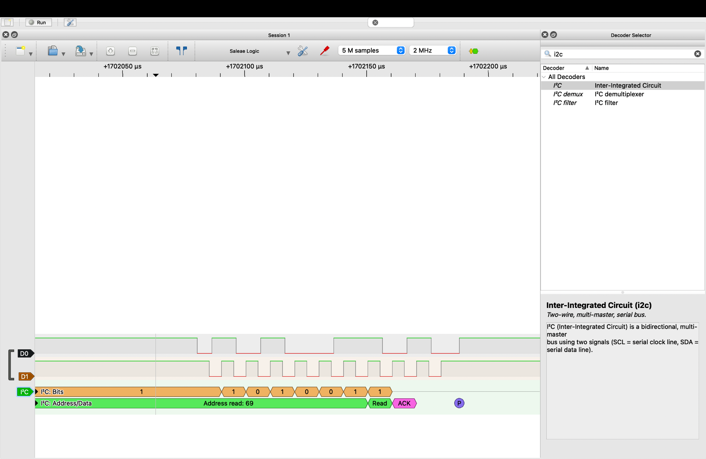
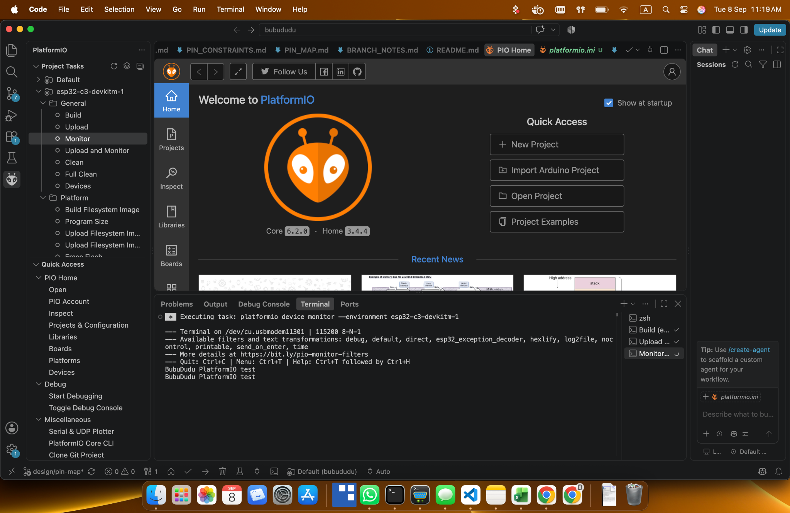

# Evidence gallery and image provenance

Four inspected screenshots copied without alteration from the supplied Desktop
`BubuDudu` image folder. The original root is
`/Users/mohamedsellami/Desktop/repos final images/BubuDudu`.
All 30 supplied images were reviewed across `favourites`, `logic-analyzer`
(SPI, I²C and setup history), `circuit-simulation` and `platformio` during the
4 October 2026 closure. The three existing selections are reused; only the
PlatformIO screenshot was added. The originals remain unchanged.

Each selected favourite duplicates a source-folder screenshot; only one copy of
each selection is included. The similar second SPI favourite and setup/decoder
screens add little to this compact gallery and were left in the original folder.
No finished-device photograph or final-firmware demonstration image was present
in this supplied set. No unrelated CampusPass assets were used.

These images illustrate debugging and simulation. They are not acceptance
passes for current firmware. See [current presentation](../../README.md),
[hardware acceptance](../../FINAL_FIRMWARE_TEST.md) and the
[development record](../../DEVLOG.md), whose earlier entries are preserved.
The new SVG at the end is a documentation diagram, separate from captured evidence.

## cc1101-spi-debug-capture.png

Historical SPI debugging: decoded MOSI/MISO exchanges, not proof of correct register configuration or RF delivery.

Source within the supplied image folder: `favourites/01_cc1101_spi_register_transactions.png`.
Byte-identical source: `logic-analyzer/spi/Screenshot 2026-09-17 at 3.06.32 PM.png`
(the original filename uses a narrow no-break space before `PM`).

SHA-256: `8632da3b05c6833399c39da907297aadfd2c30223874b98fa65e28c4620754ab`

## i2c-address-69-debug-capture.png

Historical I²C decode labelled “Address read: 69” with ACK; not successful ADXL345/OLED validation.

Source within the supplied image folder: `favourites/03_i2c_read_ack_capture.png`.
Byte-identical source: `logic-analyzer/i2c/Screenshot 2026-09-25 at 1.31.58 PM.png`
(the original filename uses a narrow no-break space before `PM`).

SHA-256: `d303dc592e9d61729ed5b1ef71c42be195bb2716fbcfb85f7282e7fb35265ed7`

## falstad-battery-indicator-simulation.png

Battery-indicator candidate in Falstad; simulation only, not assembled-circuit or battery-performance evidence.

Source within the supplied image folder: `favourites/04_falstad_circuit_candidate.png`.
Byte-identical source: `circuit-simulation/falstad_circuit_simulation.png`.
The image includes feedback experimentation; it is not proof that the saved
[simulation export](../../simulations/battery_indicator_v1.txt) has an identical
topology or that real-component hysteresis was completed. The September 19
DEVLOG entry records deferring final hysteresis and using idealized references,
comparator outputs and logic. See the [electronics reflection](../V1_REFLECTION.md#electronics-that-remain-unfinished).

SHA-256: `64d64c6fc5193f5a179eaedda53701134db19e505f5d5edac50f553d78e611b8`

## platformio-bringup-environment.png

Historical development-environment evidence: PlatformIO Home, project tasks and
a 115200-baud monitor printing `BubuDudu PlatformIO test`. The visible environment
and `design/pin-map` branch belong to early bring-up, not the final dual-identity
configuration. This is not a current build result, CI run or physical acceptance
record. Use the [host/build guide](../../tests/host/README.md) for current commands.

Source: `platformio/platformio_vscode_firmware_environment.png`.
Copied unchanged during v1 closure; not a duplicate of the existing selections.

SHA-256: `6c39cad20eb41c72a815409e330c98d3a95127d19714e293b7810203e8ed99e3`

## v1-system-flow.svg

Created for this documentation checkpoint from [Architecture](../../ARCHITECTURE.md),
[main.cpp](../../src/main.cpp) and the runtime sources. It depicts the implemented
communication paths and state ownership, not measured behavior, a wiring
schematic or a device photograph. The SVG is its editable source; it has no
external image dependency. No claim of reliable transitions follows from an arrow.
