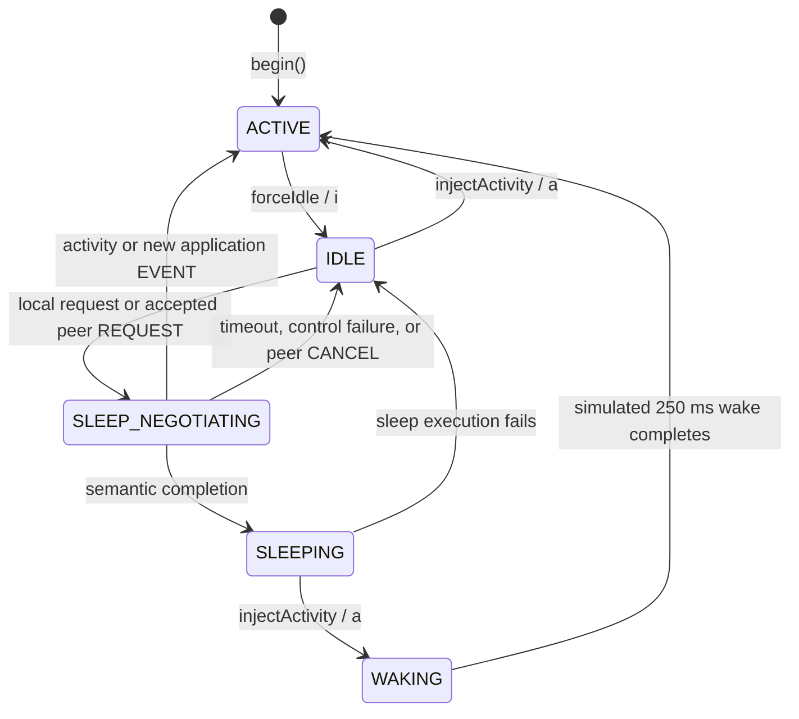
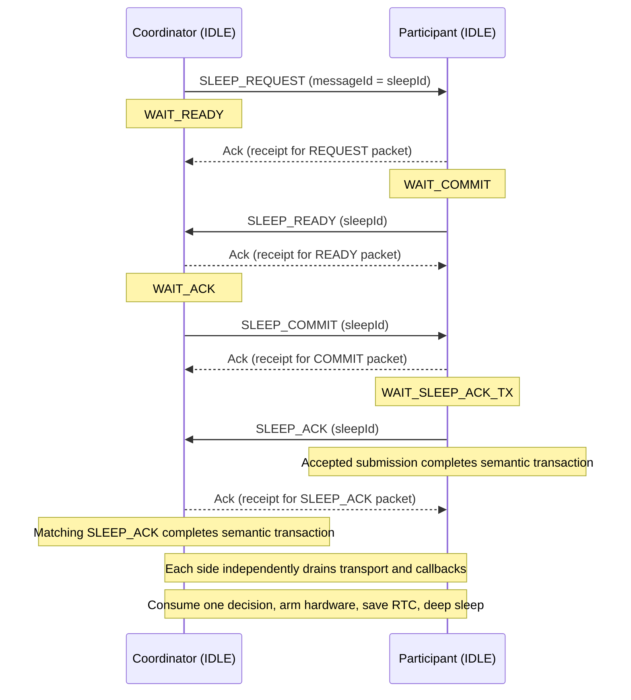

# Power management

This describes checkpoint `1b1041976b4200668c3090d27c8138dc80aa53f2`, including the sleep handshake and its current connection to real deep sleep. [PowerManager](../include/PowerManager.h) owns semantic policy, [main.cpp](../src/main.cpp) owns delivery and execution gating, and [CC1101WakeRecovery](../src/CC1101WakeRecovery.cpp) owns the shared physical-entry/recovery primitive. Packet fields and receipt semantics are in [protocol.md](protocol.md).

Some retained source comments and the startup banner still describe the earlier simulated-only checkpoint. The current `serviceSleepExecution()` path does execute deep sleep after a successful handshake and transport drain. PowerManager itself remains hardware-independent.

## Ownership and current policy

`setup()` initializes PowerManager, and `loop()` is its runtime owner. Wi-Fi callbacks copy received bytes into a bounded queue and maintain callback counters; they never advance the power FSM. The loop processes activity and deadlines before received controls, queued receipts before delivery timeouts, and physical execution after control transmission and awake CC1101 retry service.

Sleep is explicitly requested by the bench controls: `i` enters IDLE and `s` requests negotiation. Both peers must be willing to participate from IDLE. IDLE never initiates negotiation automatically, including after cooldown. Automatic heartbeat EVENTs are permitted in ACTIVE and IDLE; `h` pauses their creation for deterministic bench testing. Current `loop()` does not consume Motion activity/inactivity events to implement automatic sleep or an awake-motion UI policy.

## Local and peer states

The diagram shows runtime `LocalState` transitions. A self-transition that leaves state unchanged is omitted. Real deep sleep reboots into `setup()` and `begin()`, starting ACTIVE; it does not run through WAKING.

WAKING remains reachable through the simulated activity command while the CPU is still awake in semantic SLEEPING, such as during drain. Its `250 ms` deadline is not extended by repeated activity. It is not the physical wake-recovery state. Leaving SLEEPING discards any unconsumed sleep decision; injected activity also discards completed-COMMIT replay authority. `forceIdle()` refuses states other than ACTIVE/IDLE.

Peer state records local knowledge, not an independently verified remote state:

| Peer state | Current meaning / transition |
| --- | --- |
| `UNKNOWN` | Initial state, phase/hard timeout, queue failure, or uncertain later control delivery |
| `ONLINE` | Meaningful application activity; ordinary observation when no sleep intent is protected; activity/peer cancellation |
| `SLEEP_PENDING` | A local sleep transaction started |
| `SLEEPING` | Local handshake completed; the peer may still be draining or may later fail entry |
| `OFFLINE` | REQUEST delivery exhausted, or ordinary delivery failed outside protected sleep states |

`notePeerSeen()` and `notePeerUnreachable()` cannot overwrite SLEEP_PENDING/SLEEPING. A newly processed application EVENT explicitly marks the peer ONLINE and cancels an active negotiation. A duplicate EVENT only receives another receipt. An application EVENT alone does not move local SLEEPING through WAKING; that path uses `injectActivity()`.

## Handshake and phases

One transaction contains `sleepId`, role, phase, `startedAt`, `phaseDeadline` and `hardDeadline`. The coordinator's REQUEST packet ID is the `sleepId`; every later control carries it in `ackForMessageId`. Each control response has its own packet ID for ordinary receipts.

The sequence shows the successful path; radio delivery and callback timing can interleave. Ordinary receipts do not advance the semantic phase. Both roles begin SLEEP_NEGOTIATING with the peer SLEEP_PENDING.

| Role / phase | Accepted forward progress | Result |
| --- | --- | --- |
| Coordinator `WAIT_READY` | Matching READY | `WAIT_ACK`; queue COMMIT; fresh phase deadline |
| Coordinator `WAIT_ACK` | Matching SLEEP_ACK | Complete semantic transaction |
| Participant `WAIT_COMMIT` | Matching COMMIT | `WAIT_SLEEP_ACK_TX`; queue SLEEP_ACK; fresh phase deadline |
| Participant `WAIT_SLEEP_ACK_TX` | SLEEP_ACK accepted for transmission | Complete semantic transaction |

Completion clears the transaction, sets local and peer SLEEPING, and publishes one `SleepDecision {sleepId, role}`. The participant also records the accepted COMMIT packet ID for exact replay handling. Queueing SLEEP_ACK alone does not complete; driver acceptance does. The pending ordinary receipt for SLEEP_ACK can outlive semantic completion.

### Bounds and the final-send bug

| Bound | Value | Scope |
| --- | --- | --- |
| Phase timeout | `3000 ms` | Initial phase and first valid READY/COMMIT progress |
| Hard timeout | `5000 ms` | Entire negotiation episode, including collision role change |
| Failure cooldown | `3000 ms` | After cancellation or failed physical execution |
| Receipt timeout / retries | `300 ms` / `2` | Per reliable packet; at most three submissions |
| Physical drain timeout | `3000 ms` | From first execution service while semantic SLEEPING |

The hard deadline wins if both semantic deadlines expire together. Duplicates, retransmissions and repeated requests never extend either semantic deadline. At a send boundary PowerManager is updated and the control is checked again, preventing expired queued work from being submitted. Deadline arithmetic handles `millis()` rollover for these short intervals.

The physical delayed-collision test exposed an earlier bug: COMMIT was accepted and SLEEP_ACK queued, but the participant stayed in WAIT_COMMIT. Its old receive-phase deadline then expired before the queued final send. The fix introduced WAIT_SLEEP_ACK_TX and starts one new phase budget on the first accepted COMMIT, while retaining the original hard cap. The host regression models the old deadline at `4100 ms` and final submission at `4110 ms`; those are deterministic test timestamps, not measured board timing. The fixed collision was also rerun on both physical boards. See [September 23](../DEVLOG.md#2026-09-23) and [testFinalSendBounds](../tests/host/sleep_handshake_test.cpp).

## Arbitration, freshness and cancellation

Simultaneous requests arbitrate only while a coordinator is in WAIT_READY. Lower `DeviceId` wins: Bubu (`1`) remains coordinator; Dudu (`2`) adopts Bubu's transaction as participant. Dudu retains its original start time and hard deadline. It sends no CANCEL for the abandoned ID because both directions can have equal numeric IDs; obsolete transport work is instead retired. A request cannot take over a coordinator already in WAIT_ACK.

The peer REQUEST watermark uses modulo-65536 serial comparison: an advance of `1..32767` is fresh. It is updated before checking whether the local state can accept that request. A duplicate REQUEST for the active participant transaction can repeat READY before COMMIT, with no deadline reset. Duplicate READY in WAIT_ACK can repeat COMMIT. Duplicate current COMMIT can repeat the scheduled SLEEP_ACK intent without restarting deadlines or delivery budgets.

After completion, only the exact accepted COMMIT (`sleepId` and packet `messageId`) can request another SLEEP_ACK while local state remains SLEEPING. This is a reply receipt, not authority to recreate a transaction, decision or deadline. Other stale controls cannot advance state. Leaving that completed context or failing execution clears replay authority.

Cancellation clears the transaction and completion record, starts cooldown, and normally emits one best-effort CANCEL. Activity returns local state to ACTIVE with peer ONLINE. Peer CANCEL returns IDLE/ONLINE without echoing CANCEL. Semantic timeout or queue failure returns IDLE/UNKNOWN. Exhausted REQUEST delivery returns IDLE/OFFLINE; later active-control exhaustion returns IDLE/UNKNOWN. Cooldown expiry allows a later explicit attempt and does not start one.

Final SLEEP_ACK uncertainty is handled separately. PowerManager can already be SLEEPING when its ordinary receipt retries exhaust; it marks peer UNKNOWN. The application then calls `notifySleepExecutionFailed()`, returning local state to IDLE with cooldown. A receipt-send rejection after semantic completion similarly aborts execution. A peer may already be asleep: execution failure preserves the current peer knowledge, sends no new CANCEL and starts no automatic retry.

## Physical sleep entry

`serviceSleepExecution()` waits for the following before consuming the one-shot decision:

- Runtime ready, with an existing receive queue.
- No awake CC1101 duplicate-ACK operation.
- No pending ordinary receipt wait/retry, queued control or active sleep transaction.
- No accepted ESP-NOW sends awaiting callbacks and no active receive callback.
- No queued received messages.

If blocked for `3000 ms`, execution aborts to IDLE with cooldown. The final SLEEP_ACK sender remains awake through its ordinary receipt budget. The coordinator must also wait for its fire-and-forget receipt ACK's driver callback. Callback completion is necessary for drain but does not prove peer processing, and callback failure is not equivalent to confirmed delivery.

Once drained, execution consumes exactly one decision and calls the same physical-entry path used by the manual `x` command:

1. Prepare ADXL345 sleep activity detection and require GPIO3 LOW.
2. Invalidate old RTC state, inspect/arm CC1101, and require safe radio state.
3. Configure GPIO3 and GPIO4 active-HIGH deep wake together (`mask=0x18`), plus the `30 s` integration timer, and hold CC1101 CS HIGH.
4. Recheck transport and GPIO3 after setup/logging, save the final allocator/history snapshot, then recheck again and require GPIO4 LOW.
5. Call `esp_deep_sleep_start()`; successful entry does not return.

Any refusal, setup failure, asserted input or unexpected return invalidates RTC state and releases configured holds/wake sources. The caller restores awake Motion configuration and reports a coordinated execution failure to PowerManager. An execution attempt is not retried automatically. The manual `x` route requires ACTIVE/IDLE and drained transport but bypasses the semantic handshake.

These gates reduce known entry races and bounded failures. They do not implement distributed consensus under permanent RF loss: one board can already be asleep when the other aborts. The 30-second timer is an integration safety net, not final battery policy.

## History across deep sleep

[RtcState](../src/RtcState.cpp) stores a validated 16-byte RTC checkpoint with magic, version, flags and checksum. It retains only the next outgoing packet ID, latest peer EVENT ID with its presence flag, and latest peer REQUEST watermark with its presence flag.

It does not restore local/peer power state, a transaction or role, any deadline/cooldown, pending delivery, retries, queues, `SleepDecision`, or completed-COMMIT replay authority. Cold boot invalidates history. On a real deep wake, `begin()` first creates fresh ACTIVE/UNKNOWN runtime state, history is validated and applied before enabling ESP-NOW, and the snapshot is consumed by invalidation after a successful restore.

Boot captures reset/wake cause and GPIO3/GPIO4 levels before Serial or SPI work. Every deep wake inspects retained CC1101 state before Motion initialization or any normal radio reset, including motion and timer wake. A recovered valid packet is handled and ACKed before normal runtime starts. Healthy empty RX on motion/timer wake is valid. Invalid RTC history prevents a retained EVENT from being delivered as fresh application work.

After retained recovery, Motion initialization and successful ESP-NOW startup, a GPIO3 motion wake with no GPIO4 bit triggers one bounded peer-wake transaction. GPIO4 alone or combined GPIO3/GPIO4 suppresses the automatic return wake; timer/cold startup does not trigger it. This one-shot policy is not rearmed by refusal or failure. Physical deep wake starts ACTIVE through `begin()`, regardless of whether the optional peer wake succeeds.

## Evidence and limits

[sleep_handshake_test.cpp](../tests/host/sleep_handshake_test.cpp) compiles the actual production FSM and application loop for both identities with fake time/radio/hardware. It covers role/phase acceptance, collision including equal IDs, freshness and duplicate handling, phase/hard expiry, final-send delay, activity cancellation, one-shot decisions, callback/RX drain gates, entry failures and history restart. [espnow_drain_test.cpp](../tests/host/espnow_drain_test.cpp) separately covers the actual ESP-NOW wrapper's callback accounting. Radio, RTC and Motion suites are run by [tests/host/run.sh](../tests/host/run.sh).

The [September 23 log](../DEVLOG.md#2026-09-23) records physical simulated-handshake tests in both directions, simultaneous collision, missing peer and activity cancellation. The [September 24 log](../DEVLOG.md#2026-09-24) records real coordinated deep sleep, callback-drain correction, retained CC1101 packets and timer recovery. The [September 25 log](../DEVLOG.md#2026-09-25) records both-direction motion wake and motion-triggered peer wake, lost wake-ACK retry service, and bounded unavailable-peer failure with local runtime still usable.

Combined GPIO3/GPIO4 classification and routing were host-tested; the individual-source physical tests do not establish a reproduced simultaneous two-pin hardware stimulus. Deterministic host tests establish behavior under their modeled conditions, and the recorded bench observations establish the tested hardware scenarios. Automatic inactivity sleep, a sensitive awake-motion profile, emotional UI/proximity integration and final product power policy remain outside this checkpoint.
